# Total Ordering Distributed Transactions

## Design Description
In this mp, we use ISIS algorithm to ensure multicast in total order. We use R-multicast to achieve reliable message delivery.

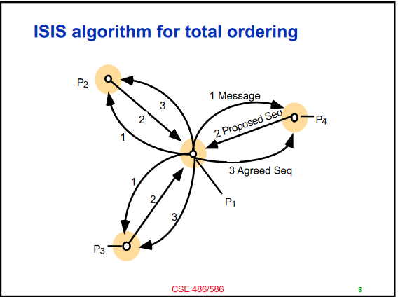

Our design can handle failure of nodes. When a node fails, all other alive nodes will detect it by raising an error when trying to send to that node. Thus, we keep track on the total number of nodes in the group and the set of failed nodes. When we are in the **Propose** or **Agree** phase, modify the algorithm to handle failure. 

In specific, pop all the transactions started by the failed nodes and recheck whether the transaction in the front of the priority queue can be delivered (only applys for the owner node of the transaction, since it will multicast "agree" signals). In addition, do not try to send to or receive from any died node.

It is justified that the fault-tolerant ISIS protocol works for the task.

## Build Instructions
There are four scenarios, call them Scenario 1 to 4.
1. 3 nodes, 0.5 Hz each, running for 100 seconds
2. 8 nodes, 5 Hz each, running for 100 seconds
3. 3 nodes, 0.5 Hz each, runing for 100 seconds, then one node fails, and the rest continue
to run for 100 seconds
4. 8 nodes, 5 Hz each, running for 100 seconds, then 3 nodes fail simultaneously, and the
rest continue to run for 100 seconds.

For Scenario 1 and 3, run the following commands in three separate terminals:

```
python -u gentx.py 0.5 | go run -race mp1_node.go node1 8881 three_nodes/node1_config.txt
python -u gentx.py 0.5 | go run -race mp1_node.go node2 8882 three_nodes/node2_config.txt
python -u gentx.py 0.5 | go run -race mp1_node.go node3 8883 three_nodes/node3_config.txt
```

For Scenario 2 and 4, run the following commands in eight separate terminals:

```
python -u gentx.py 5 | go run -race mp1_node.go node1 8881 eight_nodes/node1_config.txt
python -u gentx.py 5 | go run -race mp1_node.go node2 8882 eight_nodes/node2_config.txt
...
python -u gentx.py 5 | go run -race mp1_node.go node8 8888 eight_nodes/node8_config.txt
```

When you want to fail a node, simply send a signal by pressing <kbd>Ctrl+C</kbd> in the corresponding terminal. You should abort or end a process manually at the time you wish.

Notice that we do not need to use <kbd>Makefile</kbd> in this mp. However, we also provide that for your choice, just use <kbd>make</kbd> and then replace all the <kbd>go run -race mp1_node.go</kbd> commands with <kbd>./mp1_node</kbd>. The libraries
and packages used can found in the <kbd>mp1_node.go</kbd> source code.

For plot generation, refer to the following part.

## Evaluation Results
After building and running the code above, some intermediate data will be generated in the corresponding folders. To visualize the results, run each of the following commands for Scenario 1 to 4. 

```
python plot.py three_nodes
python plot.py eight_nodes
python plot.py three_nodes fail
python plot.py eight_nodes fail
```

Please immediately run the Python code after finishing one scenario before starting another. Running the code in one terminal is fine.

We track the **bandwidth** for each node and the amount of time between the first and the last node (of those that have not failed) have processed every message sent, which is the **time delay**.

After running one of the commands above, the plots will be generated in folders <kbd>three_nodes</kbd> and <kbd>eight_nodes</kbd> with names <kbd>bw_nodei.png</kbd>, <kbd>bw_nodei_fail.png</kbd>, <kbd>msg_delay.png</kbd> or <kbd>msg_delay_fail.png</kbd>.

We also show the result graph in the following:

### Scenario 1: 3 nodes, 0.5 Hz each, running for 100 seconds

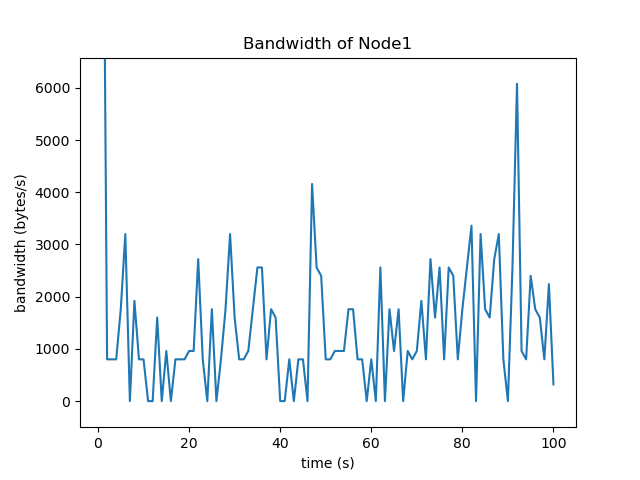
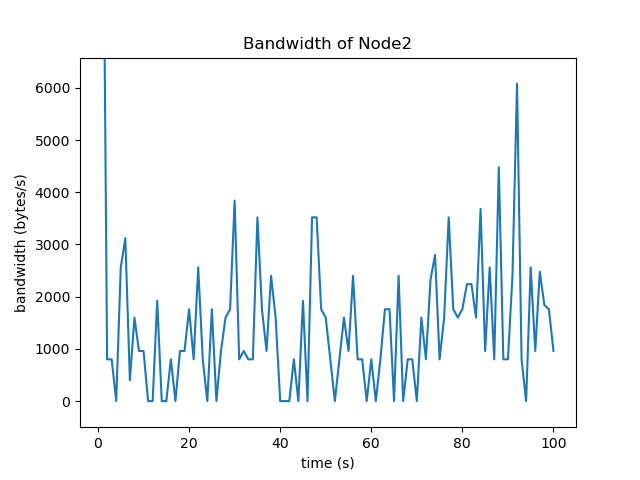
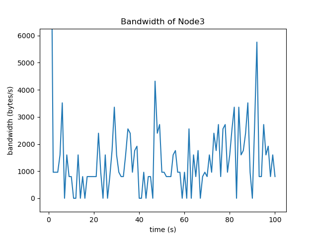
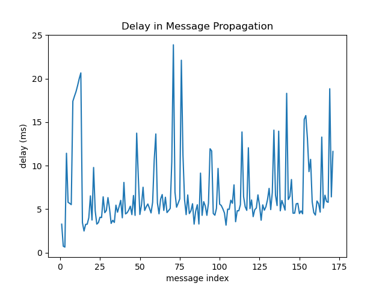

### Scenario 2: 8 nodes, 5 Hz each, running for 100 seconds

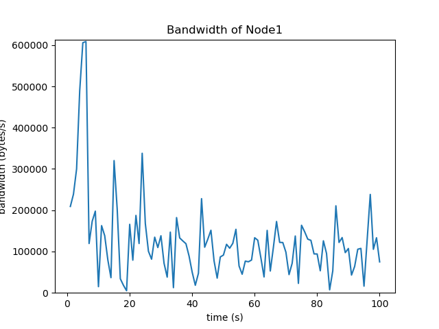
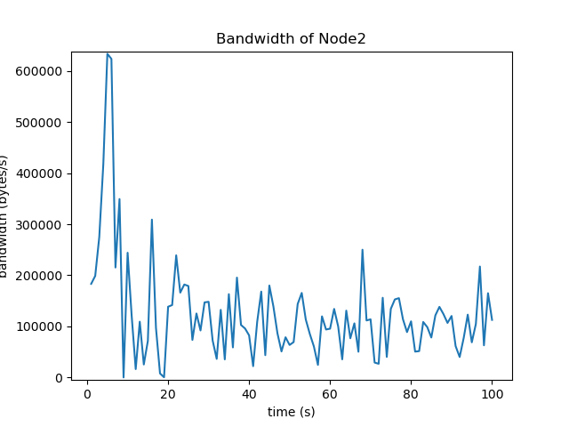
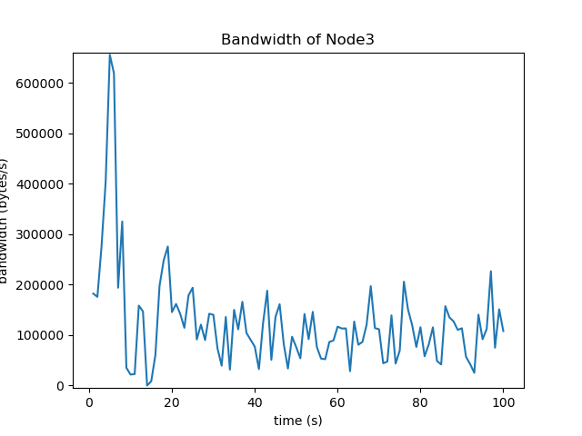
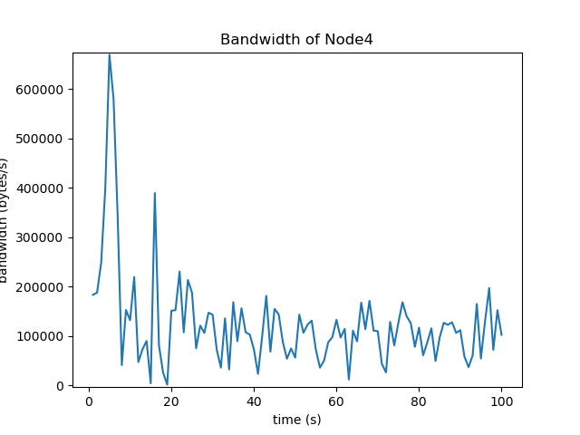
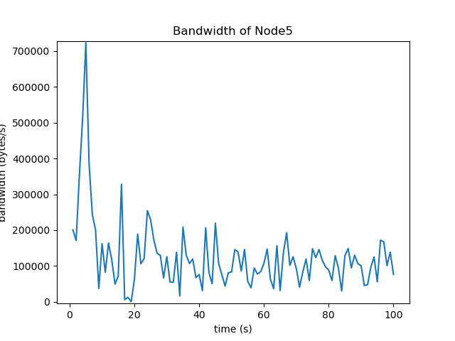
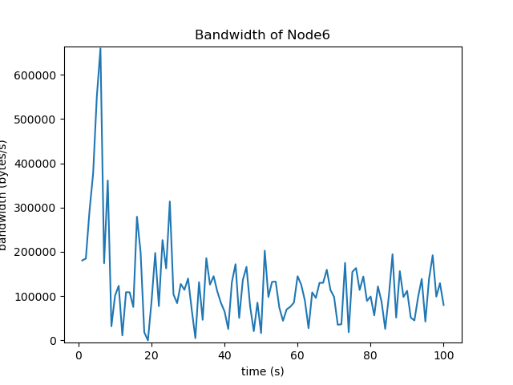
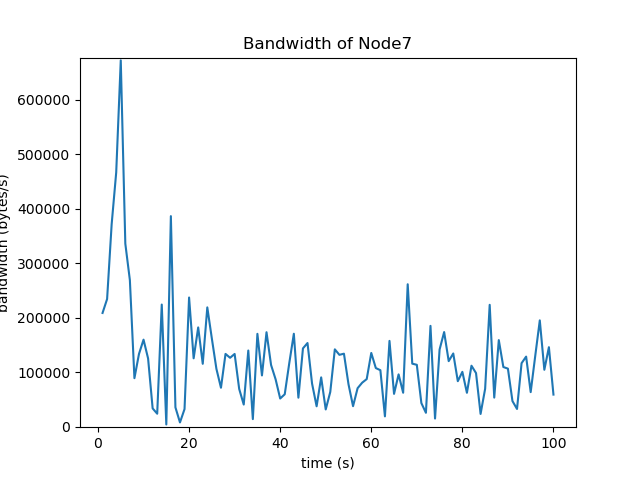
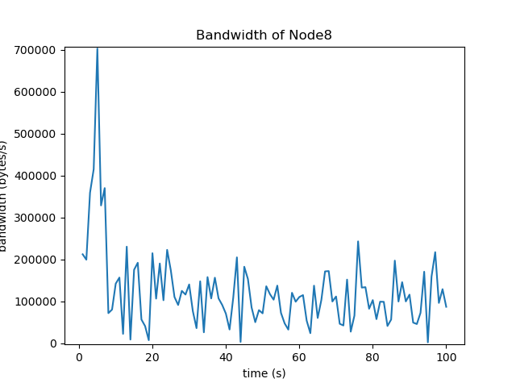
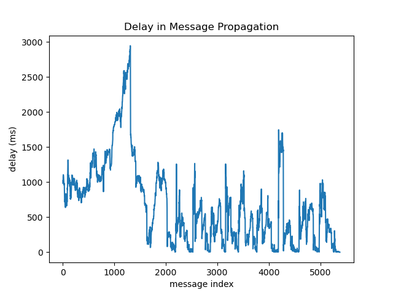


### Scenario 3: 3 nodes, 0.5 Hz each, runing for 100 seconds, then one node fails, and the rest continue to run for 100 seconds *(Node 3 fails)*

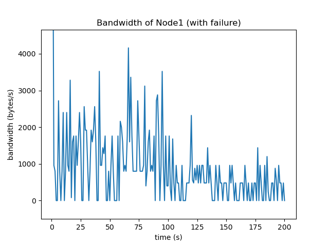
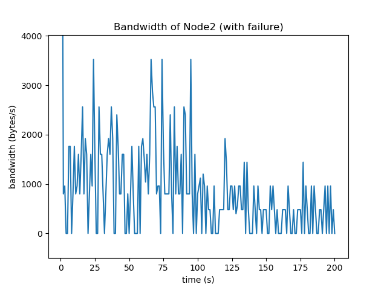
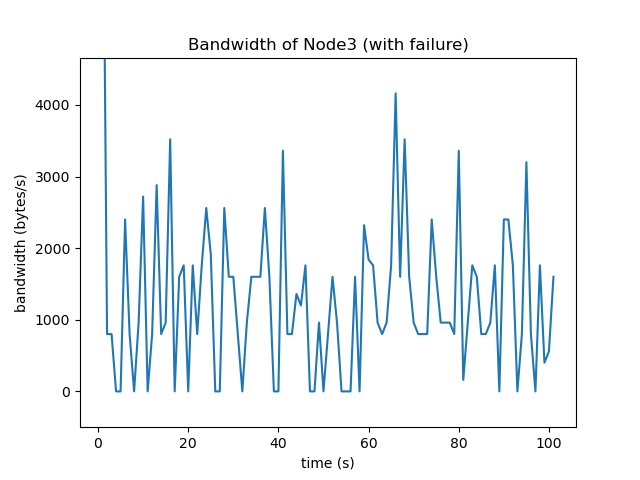
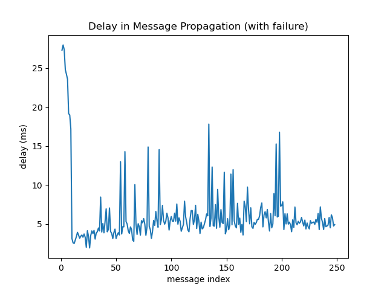

### Scenario 4: 8 nodes, 5 Hz each, running for 100 seconds, then 3 nodes fail simultaneously, and the rest continue to run for 100 seconds *(Node 6, 7, 8 fail)*

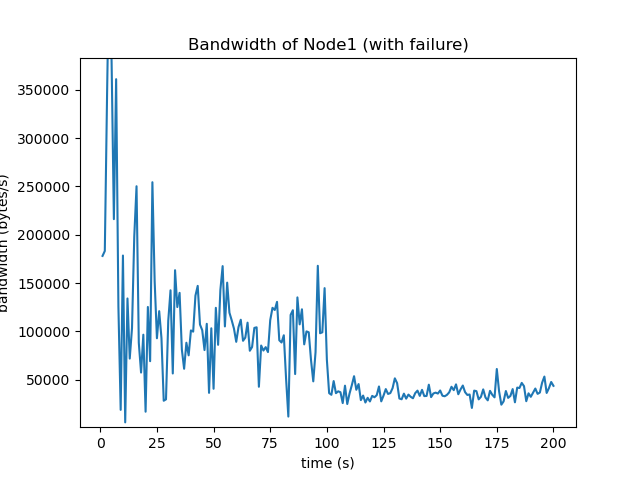
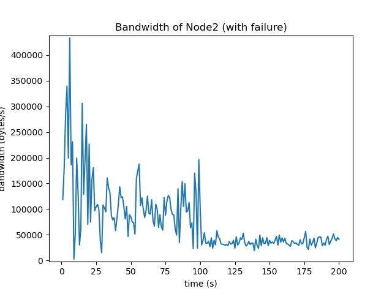
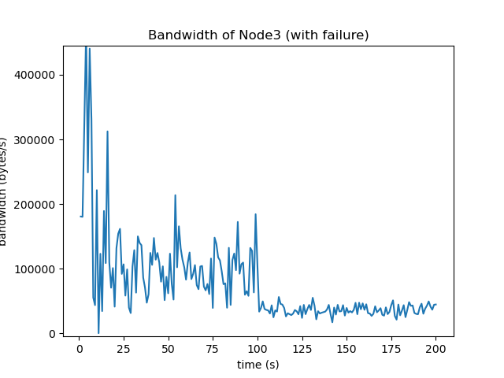
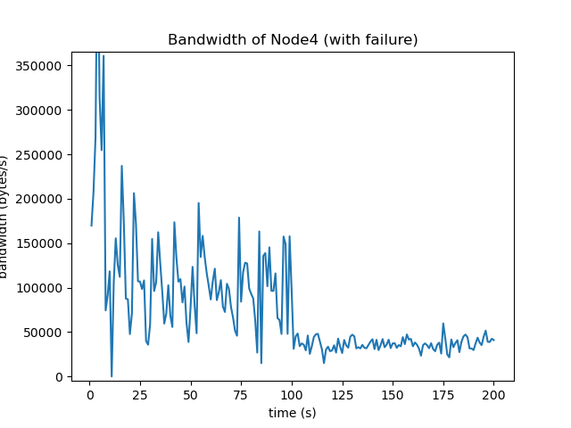
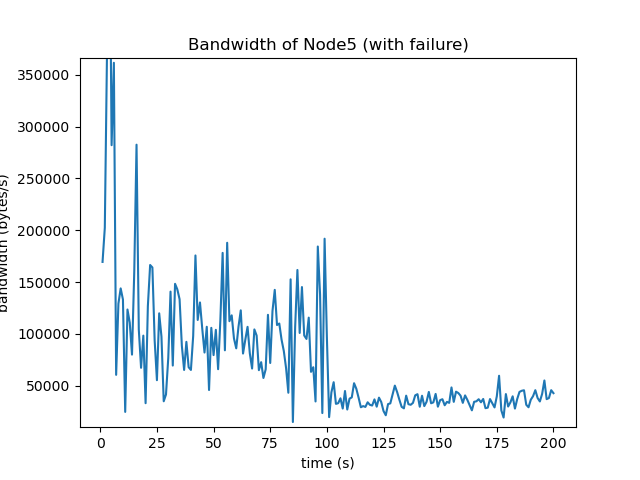
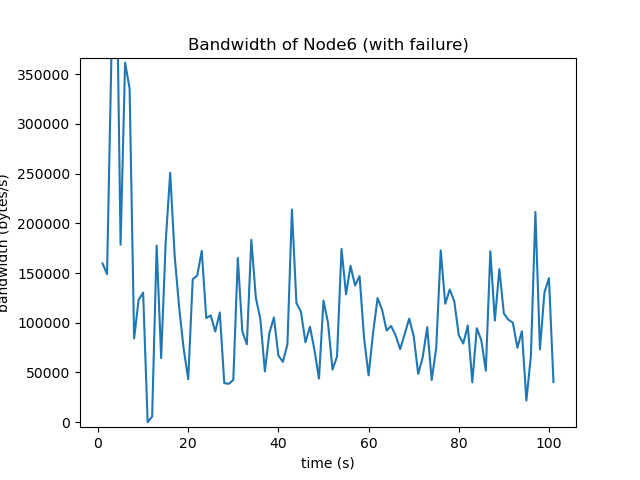
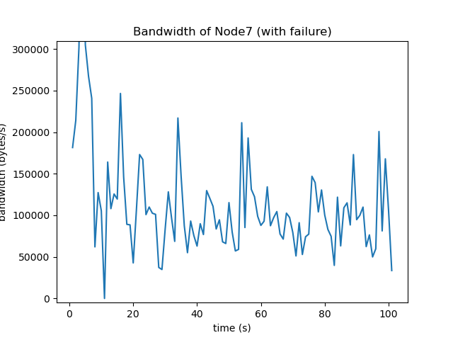
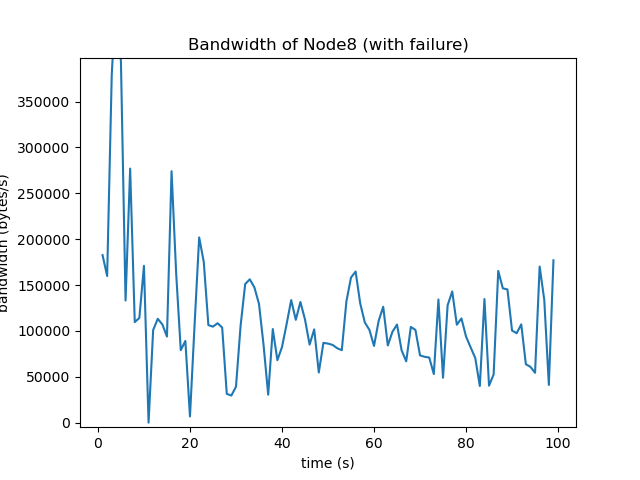
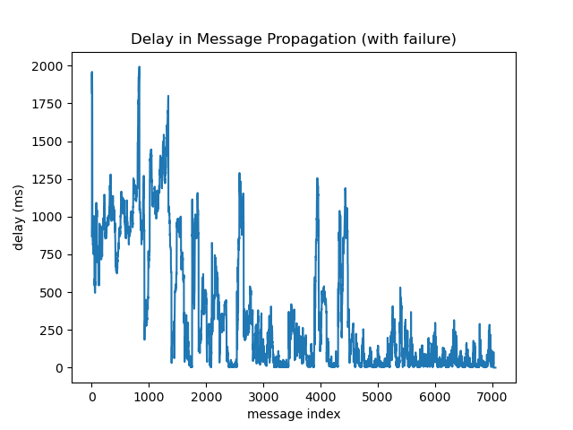


